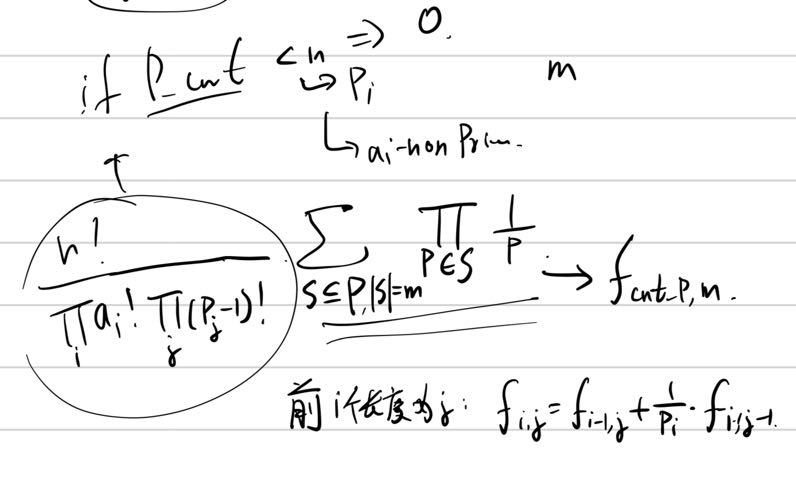

[problem](https://codeforces.com/contest/1794/problem/D)

一个很有意思的计数题，需要推一下式子然后可以发现其中有一块可以用递推求。
大概的意思就是先把质数数出来，然后我们看最后的式子，因为我们选作为底的那些质数必须是不同的，那么我们可以先认为所有质数都会被选，那么就会除掉 $(cnt_i - 1)!$ 的重复，然后我们在剩下里面的 $cntp$ 个质数里面选 $cntp - n$ 个不选就行了，这些不选的还会额外让答案除 $\frac{1}{cnt_i}$ 。用数学语言写大概是这样：



然后就像图上写的，我们可以做成一个递推式。这个递推式是 $O(n^2)$ 的，空间可以优化一维。


code: 

```cpp
#pragma G++ optimize (2)
#include <bits/stdc++.h>
#define NO 300005
#define MO 100005
#define P 998244353
#define fi first
#define se second
#define lln putchar('\n')
#define blk putchar(' ')
#define fup(i, x, y) for (int i = x; i <= y; ++i)
#define fdn(i, x, y) for (int i = x; i >= y; --i)
typedef long long ll;
typedef double db;
using namespace std;
typedef pair<int, int> pii;
inline ll read()
{
	char ch = ' ', last;
	ll ans = 0;
	while (ch < '0' || ch > '9')
		last = ch, ch = getchar();
	while (ch >= '0' && ch <= '9')
		ans = ans * 10 + int(ch - '0'), ch = getchar();
	if (last == '-')
		return -ans;
	return ans;
}
void write(ll x)
{
    if (x < 0)
        putchar('-'), x = -x;
	if (x >= 10)
		write(x / 10);
	putchar(x % 10 + '0');
}
//head

//variables

int fast(int x, int y) {
    int ret = 1;
    while (y) {
        if (y & 1)
            ret = (ll)ret * x % P;
        x = (ll)x * x % P;
        y >>= 1;
    }
    return ret % P;
}
void init()
{
    vector<int> p;
    vector<bool> isP(1e6 + 1, true);
    isP[1] = false;
    fup (i, 2, 1e6) {
        if (isP[i]) {
            p.push_back(i);
        }
        for (int j = 0; j < p.size() && i * p[j] <= 1e6; ++j) {
            isP[i * p[j]] = false;
            if (i % p[j] == 0)
                break;
        }
    }
    int n = read();
    vector<int> a(n << 1 | 1), fac(n + 1, 1);
    fup (i, 1, n)
        fac[i] = (ll)fac[i - 1] * i % P;
    map<int, int> ma;
    fup (i, 1, n << 1)
        a[i] = read(), ++ma[a[i]];
    int cntp = 0, totp = 0, ans = fac[n];
    vector<int> b;
    b.push_back(0);
    for (auto [v, cnt] : ma) {
        if (isP[v])
            ++cntp, totp += cnt, ans = (ll)ans * fast(fac[cnt - 1], P - 2) % P, b.push_back(fast(cnt, P - 2));
        else 
            ans = (ll)ans * fast(fac[cnt], P - 2) % P;
    }
    if (cntp < n) {
        puts("0");
        return;
    }
    vector<int> f(cntp + 1, 0);
    f[0] = 1, f[1] = b[1];
    fup (i, 2, cntp) {
        fdn (j, min((cntp - n), i), 1)
            f[j] = ((ll)f[j] + (ll)b[i] * f[j - 1] % P) % P;
        // fup (i, 1, cntp)
        //     cout << f[i] << ' ';
        // cout << endl;
    }
    write((ll) ans * f[cntp - n] % P), lln;
}
//functions

int main()
{

	// freopen("a.out", "w", stdout);
	#ifdef LLOCAL
	freopen("a.in", "r", stdin);
	#endif
    ios_base::sync_with_stdio(0);
    cin.tie(0), cout.tie(0);
    // int t = read();
	// while (t--)
		init();
	return 0;
}
//main
/*

*/
```

