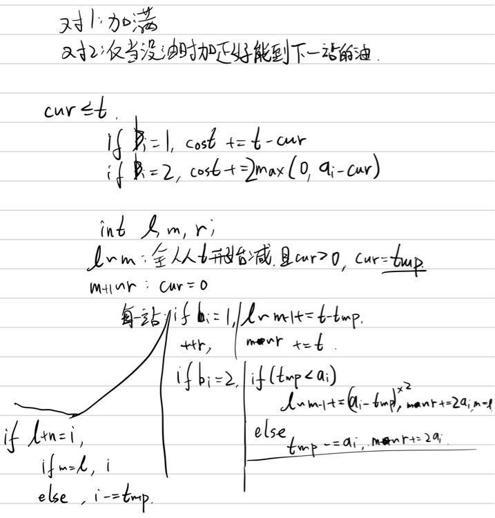

[problem](https://codeforces.com/contest/1809/problem/F)

挺有意思的题，其实主要是思路，具体分类讨论出来之后用一个树状数组实现区间加和单点查询就可以了
首先可以做一个贪心，然后分析一下就只有下面几种情况：



code: 

```cpp
#pragma G++ optimize (2)
#include <bits/stdc++.h>
#define NO 300005
#define MO 100005
#define P 998244353
#define fi first
#define se second
#define lln putchar('\n')
#define blk putchar(' ')
#define fup(i, x, y) for (int i = x; i <= y; ++i)
#define fdn(i, x, y) for (int i = x; i >= y; --i)
typedef long long ll;
typedef double db;
using namespace std;
typedef pair<int, int> pii;
inline ll read()
{
	char ch = ' ', last;
	ll ans = 0;
	while (ch < '0' || ch > '9')
		last = ch, ch = getchar();
	while (ch >= '0' && ch <= '9')
		ans = ans * 10 + int(ch - '0'), ch = getchar();
	if (last == '-')
		return -ans;
	return ans;
}
void write(ll x)
{
    if (x < 0)
        putchar('-'), x = -x;
	if (x >= 10)
		write(x / 10);
	putchar(x % 10 + '0');
}
//head

template<typename T>
struct BinaryIndexTree {
private:
	std::vector<T> a;
	T nullValue;
	std::function<T(T, T)> aggreFunc;
	std::function<T(T)> negFunc;
    int n;

public:
	BinaryIndexTree(int __n, T __nullValue, std::function<T(T, T)> __aggreFunc, std::function<T(T)> __negFunc) : n(__n), nullValue(__nullValue), aggreFunc(__aggreFunc), negFunc(__negFunc) {
		a.resize(n + 1);
	}

    inline void add(int x, T v) {
        if (x < 1 || x > n)
            return;
        for (; x <= n; x += x & -x)
            a[x] = aggreFunc(a[x], v);
    }

    inline T query(int x) {
        if (x < 1 || x > n)
            return nullValue;
        T res = nullValue;
        for (; x; x -= x & -x)
            res = aggreFunc(res, a[x]);
        return res;
    }

    inline void add(int l, int r, T v) {
        if (l > r || l > n || r > n || l < 1 || r < 1)
            return;
        add(l, v);
        add(r + 1, negFunc(v));
    }

    inline T query(int l, int r) {
        if (l > r || l > n || r > n || l < 1 || r < 1)
            return nullValue;
        return aggreFunc(query(r), negFunc(query(l - 1)));
    }
};
//templates

void init()
{
    int n = read(), t = read();
    vector<int> a(n << 1 | 1), b(n << 1 | 1);
    fup (i, 1, n)
        a[i] = a[i + n] = read();
    fup (i, 1, n)
        b[i] = b[i + n] = read();
    BinaryIndexTree<ll> c(n, 0, plus<ll>(), negate<ll>());
    int l = 1, m = 1, r = 0, tmp = 0;
    fup (i, 1, n << 1) {
        if (i <= n)
            ++r;
        else {
            write(c.query(l++) - tmp), blk;
        }
        if (b[i] == 1)
            c.add(l, m - 1, t - tmp), c.add(m, r, t), tmp = t - a[i], m = r + 1;
        else {
            if (tmp < a[i])
                c.add(l, m - 1, (a[i] - tmp) << 1), c.add(m, r, a[i] << 1), m = l, tmp = 0;
            else 
                tmp -= a[i], c.add(m, r, a[i] << 1);
        }
        // write(l), blk, write(m), blk, write(r), blk, write(tmp), putchar(':');
        // fup (i, 1, n)
        //     write(c.query(i)), blk;
        // lln;
    }
    lln;
}
//functions

int main()
{

	// freopen("a.out", "w", stdout);
	#ifdef LLOCAL
	freopen("a.in", "r", stdin);
	#endif
    ios_base::sync_with_stdio(0);
    cin.tie(0), cout.tie(0);
    int t = read();
	while (t--)
		init();
	return 0;
}
//main
```

