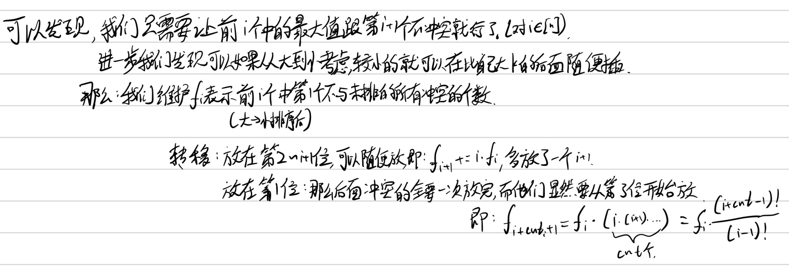

[problem](https://codeforces.com/contest/1809/problem/G)

思路题，难点在于dp状态设计。



然后[这一题](https://codeforces.com/problemset/problem/1437/F)跟上面那一题非常像，几乎只要把a-k改成a/2就行了，不过要稍微注意一下边界。看数据范围会发现这一题其实更简单，用更简单的n方dp也可以过。


code: 

```cpp
//CF1809G
#pragma G++ optimize (2)
#include <bits/stdc++.h>
#define NO 300005
#define MO 100005
#define fi first
#define se second
#define lln putchar('\n')
#define blk putchar(' ')
#define fup(i, x, y) for (int i = x; i <= y; ++i)
#define fdn(i, x, y) for (int i = x; i >= y; --i)
typedef long long ll;
typedef double db;
using namespace std;
typedef pair<int, int> pii;
inline ll read()
{
	char ch = ' ', last;
	ll ans = 0;
	while (ch < '0' || ch > '9')
		last = ch, ch = getchar();
	while (ch >= '0' && ch <= '9')
		ans = ans * 10 + int(ch - '0'), ch = getchar();
	if (last == '-')
		return -ans;
	return ans;
}
void write(ll x)
{
    if (x < 0)
        putchar('-'), x = -x;
	if (x >= 10)
		write(x / 10);
	putchar(x % 10 + '0');
}
//head

struct Int {
private:
    int v, inn;
    const static int mod = 998244353;
    
public:
    Int() : v(0), inn(0) {}
    Int(long long __v) : v(__v % mod), inn(0) {}

    int get() { return v; }

    inline long long inv() {
        if (inn)
            return inn;
        long long a = v, b = mod - 2;
        inn = 1;
        while (b) {
            if (b & 1)
                inn = inn * a % mod;
            a = a * a % mod;
            b >>= 1;
        }
        return inn % mod;
    }
    Int operator + (const Int &rhs) { return ((long long)v + rhs.v) % mod; }
    Int operator - (const Int &rhs) { return (v - rhs.v + mod) % mod; }
    Int operator * (const Int &rhs) { return (long long)v * rhs.v % mod; }
    Int operator / (Int &rhs) { return (long long)v * rhs.inv() % mod; }
    Int operator - () { return mod - v; }
    Int &operator += (const Int &rhs) { return *this = *this + rhs; }
    Int &operator -= (const Int &rhs) { return *this = *this - rhs; }
    Int &operator *= (const Int &rhs) { return *this = *this * rhs; }
    Int &operator /= (Int &rhs) { return *this = *this / rhs; }
};
//templates

void init()
{
    int n = read(), k = read();
    vector<int> a(n + 1);
    fup (i, 1, n)
        a[i] = read();
    sort(a.begin() + 1, a.end(), greater<int>());
    vector<int> nxt(n + 1);
    fup (i, 1, n) 
        nxt[i] = upper_bound(a.begin() + 1, a.end(), a[i] - k, greater<int>()) - a.begin();
    // fup (i, 1, n)
    //     cout << nxt[i] << ' ';
    // cout << endl;
    vector<Int> fac(n + 1);
    fac[0] = 1;
    fup (i, 1, n)
        fac[i] = fac[i - 1] * i;
    vector<Int> f(n + 1);
    if (a[1] - a[2] <= k) {
        puts("0");
        return;
    }
    f[1] = 1;
    fup (i, 1, n - 1) {
        f[i + 1] += f[i] * i;
        f[nxt[i + 1] - 1] += f[i] * fac[max(0, nxt[i + 1] - 3)] / fac[i - 1];
    }
    // fup (i, 1, n)
    //     write(f[i].get()), blk;
    write(f[n].get()), lln;
}
//functions

int main()
{
	// freopen("a.out", "w", stdout);
	#ifdef LLOCAL
	freopen("a.in", "r", stdin);
	#endif
    ios_base::sync_with_stdio(0);
    cin.tie(0), cout.tie(0);
    // int t = read();
	// while (t--)
		init();
	return 0;
}
//main
/*

*/
```

```cpp
//CF1437F
#pragma G++ optimize (2)
#include <bits/stdc++.h>
#define NO 300005
#define MO 100005
#define fi first
#define se second
#define lln putchar('\n')
#define blk putchar(' ')
#define fup(i, x, y) for (int i = x; i <= y; ++i)
#define fdn(i, x, y) for (int i = x; i >= y; --i)
typedef long long ll;
typedef double db;
using namespace std;
typedef pair<int, int> pii;
inline ll read()
{
	char ch = ' ', last;
	ll ans = 0;
	while (ch < '0' || ch > '9')
		last = ch, ch = getchar();
	while (ch >= '0' && ch <= '9')
		ans = ans * 10 + int(ch - '0'), ch = getchar();
	if (last == '-')
		return -ans;
	return ans;
}
void write(ll x)
{
    if (x < 0)
        putchar('-'), x = -x;
	if (x >= 10)
		write(x / 10);
	putchar(x % 10 + '0');
}
//head

struct Int {
private:
    int v, inn;
    const static int mod = 998244353;

public:
    Int() : v(0), inn(0) {}
    Int(long long __v) : v(__v % mod), inn(0) {}

    int get() { return v; }

    inline long long inv() {
        if (inn)
            return inn;
        long long a = v, b = mod - 2;
        inn = 1;
        while (b) {
            if (b & 1)
                inn = inn * a % mod;
            a = a * a % mod;
            b >>= 1;
        }
        return inn % mod;
    }
    Int operator + (const Int &rhs) { return ((long long)v + rhs.v) % mod; }
    Int operator - (const Int &rhs) { return (v - rhs.v + mod) % mod; }
    Int operator * (const Int &rhs) { return (long long)v * rhs.v % mod; }
    Int operator / (Int &rhs) { return (long long)v * rhs.inv() % mod; }
    Int operator - () { return mod - v; }
    Int &operator += (const Int &rhs) { return *this = *this + rhs; }
    Int &operator -= (const Int &rhs) { return *this = *this - rhs; }
    Int &operator *= (const Int &rhs) { return *this = *this * rhs; }
    Int &operator /= (Int &rhs) { return *this = *this / rhs; }
};
//templates

void init()
{
    int n = read();//, k = read();
    vector<int> a(n + 1);
    fup (i, 1, n)
        a[i] = read();
    sort(a.begin() + 1, a.end(), greater<int>());
    vector<int> nxt(n + 1);
    fup (i, 1, n) 
        nxt[i] = upper_bound(a.begin() + 1, a.end(), a[i] / 2 + 1, greater<int>()) - a.begin();
    // fup (i, 1, n)
    //     cout << nxt[i] << ' ';
    // cout << endl;
    vector<Int> fac(n + 1);
    fac[0] = 1;
    fup (i, 1, n)
        fac[i] = fac[i - 1] * i;
    vector<Int> f(n + 1);
    if (a[1] / 2 < a[2]) {
        puts("0");
        return;
    }
    f[1] = 1;
    fup (i, 1, n - 1) {
        f[i + 1] += f[i] * i;
        f[nxt[i + 1] - 1] += f[i] * fac[max(0, nxt[i + 1] - 3)] / fac[i - 1];
    }
    // fup (i, 1, n)
    //     write(f[i].get()), blk;
    write(f[n].get()), lln;
}
//functions

int main()
{
	// freopen("a.out", "w", stdout);
	#ifdef LLOCAL
	freopen("a.in", "r", stdin);
	#endif
    ios_base::sync_with_stdio(0);
    cin.tie(0), cout.tie(0);
    // int t = read();
	// while (t--)
		init();
	return 0;
}
//main
/*

*/
```